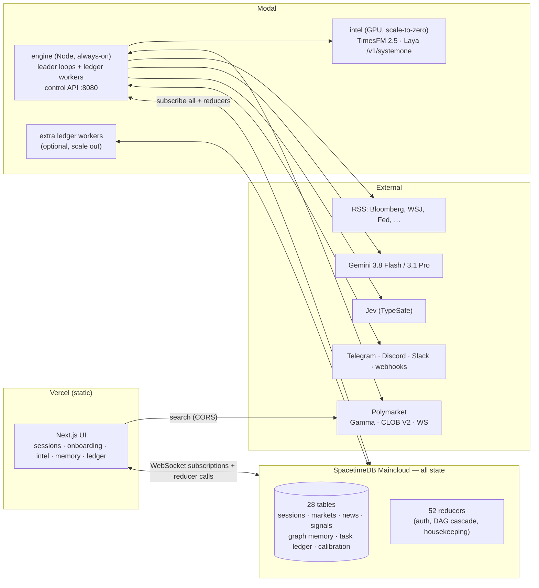
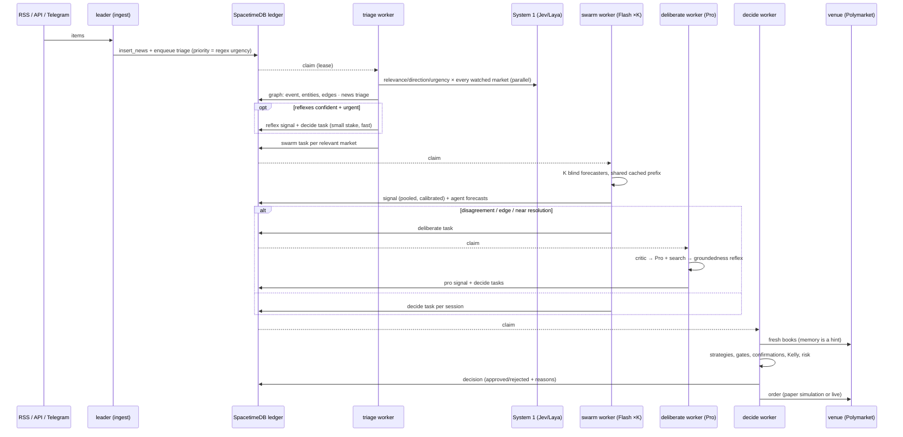

# MIDAS architecture

MIDAS turns news into calibrated, risk-sized prediction-market trades, and
learns from every outcome. This page is the map; `CLAUDE.md` holds the rules,
`docs/RESEARCH.md` the evidence behind each design choice.

## Deployment shape



The browser talks to SpacetimeDB directly; there is no web server. The
engine is stateless: kill it and a new container resumes from the tables.

## Three timescales

| Timescale | Who | What it does | Where |
|---|---|---|---|
| **milliseconds** — System 1 | Jev / Laya (or Flash-Lite / heuristic fallback) | typed, calibrated reflexes fanned out over every (headline × market), (position × tick), (entity × entity) pair: relevance, direction, urgency, novelty, escalate?, exit?, same entity?, grounded?, wiki stale? | `apps/engine/src/s1/*`, `packages/core/src/reflex.ts` |
| **seconds** — System 2 | Gemini Flash swarm → Gemini Pro supervisor | blind forecasts (fair value + log-odds news impact + half-life), pooled by formula; Pro resolves disagreements with search, faces a critic, passes a groundedness reflex | `apps/engine/src/intel/{swarm,deliberate}.ts` |
| **minutes–hours** — learning | Gemini Pro coach + deterministic scorers | reaction scoring, calibration, lessons, agent evolution (GEPA-style ratchet), reflex coaching (rewrite the question, replay, keep only if better), memory consolidation, wiki compilation | `apps/engine/src/learn/*`, `apps/engine/src/memory/*` |

The coach tuning System 1 is the "skateboarder" loop: reflexes fire thousands
of times a day, every firing is logged with a replayable state snapshot, and a
slow System-2 pass rewrites the reflex from its misfires — accepted only when
a paired replay says it is better.

## The pipeline for one headline



## Planes (graph-engineering reference architecture)

| Plane | Tables | Rule |
|---|---|---|
| control | `session`, `session_market`, `seed_file`, `global_flag`, `operator(_request)` | humans own money and risk; agents never write them |
| execution | `agent_task` (the ledger), `engine_heartbeat` | leases, retries, dependency cascade, pausable cognition |
| artifact | `signal`, `agent_forecast`, `path_forecast`, `decision`, `trade_order`, `position`, `equity_point` | every output traceable to news, agents, gates and a fill |
| graph | `mem_node`, `mem_edge` | bi-temporal, provenance on every edge, reversible merges, point-in-time reads |
| evaluation | `decision.verdict/reasons`, `calibration_sample`, `calibrator`, `reflex`, `agent` fitness, `evolution_trial` | only ground truth teaches; ratchet or revert |

"Every important output can be traced to an objective, a plan, an artifact, a
source, a graph path, an evaluator decision, and a bounded execution record."

## The ledger (execution plane)

`agent_task` rows are the unit of work: `kind`, `payload` (JSON), `status`
(`blocked → pending → running → done | failed | cancelled`), `deps`, lease
owner/expiry, attempts, model, tokens, cached tokens, cost. Reducers do the
bookkeeping transactionally:

- `enqueue_tasks` — idempotent by `dedupe_key`; tasks with unfinished
  dependencies start `blocked`.
- `claim_tasks` — a worker leases up to *n* runnable tasks (priority, then age).
- `complete_task` — marks done, **unblocks dependents** ("falling dominoes"),
  enqueues follow-ups atomically.
- `fail_task` — retry with backoff or fail and cancel dependents.
- scheduled `housekeeping` — reaps expired leases every 30 s, prunes history.

Any number of engine processes can pull from the ledger. That is the
parallelism knob: pool sizes per kind (`MIDAS_WORKERS_*`) and extra worker
containers on Modal (`MIDAS_ROLE=worker`).

Task kinds: `triage`, `swarm`, `deliberate`, `decide`, `reflect`, `calibrate`,
`forecast`, `wiki`, `dream`, `evolve`, `coach`, `arb`.

## Memory

- **Graph** (`mem_node`/`mem_edge`): entities, events (news), markets,
  lessons. Edges: `mentions`, `about`, `related`, `moved` (realized Δ after a
  headline — the empirical prior), `lesson_for`, `learned_from`,
  `merged_into`. Retrieval = HippoRAG-style Personalized PageRank (damping 0.5,
  ≤5 seeds weighted by specificity) + embedding cosine + recency + salience,
  with `asOfMs` for replays.
- **Analog prior**: realized reactions of similar past headlines, kernel-
  weighted by embedding similarity and age, blended into the swarm's expected
  move when the effective sample size is ≥2. This is compounding experience in
  numbers, not prose.
- **Lessons**: written by the reflection task after big misses; credited
  helpful/harmful only by later outcomes (ACE); retracted when harmful ≥
  helpful + 2; injected into prompts on demand via retrieval.
- **LLM wiki** (per session, in `seed_file`): `raw/` immutable, `wiki/`
  compiled by agents (market pages, lessons, index, log), `SCHEMA.md`
  conventions. A `wiki.stale` reflex lints pages in parallel; only stale pages
  are recompiled.
- **autoDream**: when the queue is idle, entity resolution (lexical candidates
  → `entity.same` reflex at p ≥ 0.9 → reversible merge), draft promotion,
  lesson retraction.

## Decisions (deterministic)

`apps/engine/src/trade/decide.ts`, per (signal × session):

1. Fresh YES/NO books from the venue.
2. Candidates: **reaction** (trade the predicted move; skip if ≥50% already
   happened; exit on target/stop/time/exit-reflex) and **value** (market-
   blended fair value at trust ≈0.25; mid in [0.15, 0.85]; ≥72 h to
   resolution; hurdle = minEdge + half-spread + fee + 1.5× ensemble spread;
   ≥70% of forecasters on the side; post-only maker orders).
3. Gates: global halt, session status, live triple-gate, opposite position,
   max open positions, circuit breakers, event-cluster cap, independent
   confirmations ≥2 (Pro, swarm agreement, analogs, System-1 direction, price
   momentum, path forecast).
4. Size: fractional Kelly × confirmation confidence, walked through the book,
   capped by per-market / gross / cash / 20%-of-depth limits.
5. Record the decision with every reason, then execute (paper simulates
   fills against the real book including taker fees; resting maker orders
   fill only when the market trades through).

Portfolio loop: mark to the bid, settle resolutions, exits, daily-loss pause,
drawdown kill switch, equity curve.

## Code map

```
spacetimedb/src/            schema.ts (28 tables) · index.ts (52 reducers)
packages/core/src/          pure, tested math: prob, aggregate, calibration,
                            kelly, risk, graph (PPR), reaction, reflex,
                            evolution (Pareto + ratchet), seed folders
packages/stdb-bindings/     generated client bindings (npm run stdb:generate)
apps/engine/src/
  index.ts                  boot, roles, loops
  stdb.ts · config.ts       connection, env
  s1/                       System-1 clients (Jev/Laya/Flash/heuristic), reflex engine
  llm/                      Gemini, OpenRouter alt family, prompts, usage meter
  feeds/rss.ts              verified feed registry, conditional GET
  venues/                   Polymarket (+WS, CLOB V2), Manifold, Kalshi
  market/hub.ts             watched markets, live prices, 1-min bars
  intel/                    ingest, triage, swarm, deliberate, forecast, arb
  trade/                    decide, executor, portfolio, readiness
  learn/                    score, calibrate, reflect, evolve (+ reflex coach)
  memory/                   graph, wiki, dream
  ledger/                   worker, scheduler, task helpers
  connectors/               HTTP control API, Telegram, alerts
  mcp.ts                    MCP server over the control API
apps/web/                   static Next.js UI
modal/                      intel service (TimesFM + Laya), engine host
seeds/                      example seed folder
```
